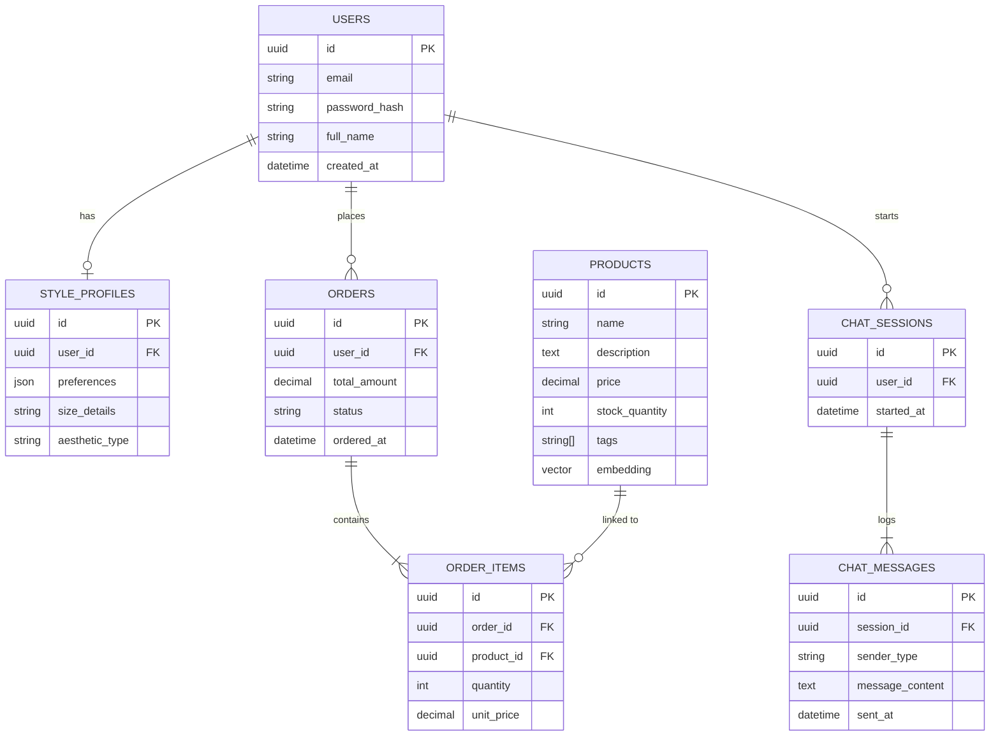

# ER Diagram

---
### 📑 Navigation
[Idea](idea.md) | [Use Case](useCaseDiagram.md) | [Sequence](sequenceDiagram.md) | [Class Diagram](classDiagram.md) | [ER Diagram](ErDiagram.md)
---

## Details
The **Entity-Relationship (ER) Diagram** represents the persisted data layer of the AI Personal Shopper Store. It illustrates the tables (Entities) such as Users, Products, and Orders, along with their attributes and foreign key relationships. A key feature is the inclusion of a `vector embedding` in the Products table, which enables high-speed semantic search using AI models.
