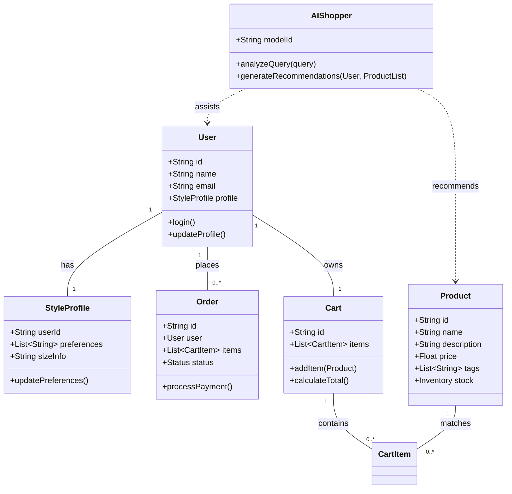

# Class Diagram

The following diagram represents the core class structure and relationships within the TypeScript application.

```mermaid
classDiagram
    class User {
        +String id
        +String name
        +String email
        +StyleProfile profile
        +login()
        +updateProfile()
    }

    class StyleProfile {
        +String userId
        +List~String~ preferences
        +String sizeInfo
        +updatePreferences()
    }

    class Product {
        +String id
        +String name
        +String description
        +Float price
        +List~String~ tags
        +Inventory stock
    }

    class AIShopper {
        +String modelId
        +analyzeQuery(query)
        +generateRecommendations(User, ProductList)
    }

    class Cart {
        +String id
        +List~CartItem~ items
        +addItem(Product)
        +calculateTotal()
    }

    class Order {
        +String id
        +User user
        +List~CartItem~ items
        +Status status
        +processPayment()
    }

    User "1" -- "1" StyleProfile : has
    User "1" -- "0..*" Order : places
    User "1" -- "1" Cart : owns
    Cart "1" -- "0..*" CartItem : contains
    Product "1" -- "0..*" CartItem : matches
    AIShopper ..> User : assists
    AIShopper ..> Product : recommends
```
