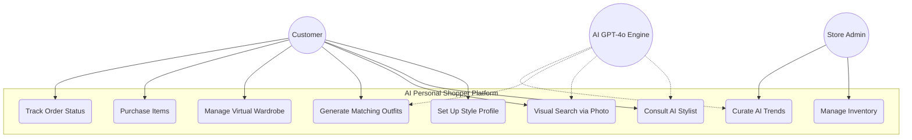

# Use Case Diagram

---
### 📑 Navigation
[Idea](idea.md) | [Use Case](useCaseDiagram.md) | [Sequence](sequenceDiagram.md) | [Class Diagram](classDiagram.md) | [ER Diagram](ErDiagram.md)
---

## Visual Illustration

## System Boundaries & Interactions

## Details

| Use Case | Actor | Description |
| :--- | :--- | :--- |
| **Set Up Style Profile** | Customer | Users input measurements, favorite colors, and style preferences. |
| **Consult AI Stylist** | Customer, AI | Natural language chat to find products for specific occasions. |
| **Visual Search** | Customer, AI | Uploading a photo to find visually similar items in the store. |
| **Generate Outfits** | AI | Automatically suggesting items that pair well together. |
| **Manage Inventory** | Admin | Adding new products, updating stock levels, and managing tags. |

### Key Improvements
- **Multi-Actor Collaboration**: Highlights how the **AI Engine** works alongside the Customer to fulfill complex requests.
- **Admin Roles**: Clearly defines back-office tasks like inventory and trend curation.
- **Expanded Scope**: Now includes modern features like **Visual Search** and **Virtual Wardrobe management**.
